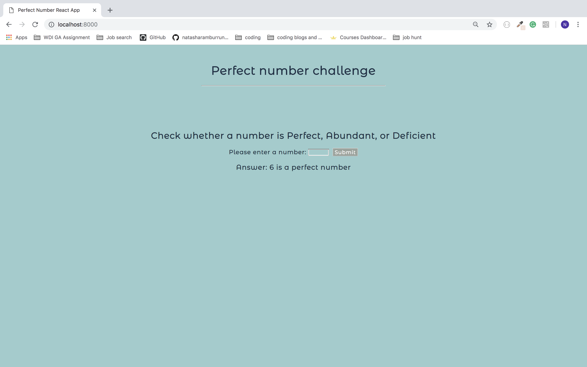

# Perfect Number Challenge - React web application #

### Task: ###

Write a function to determine whether a given number is perfect, abundant, or deficient:

Once you have created your function to check a perfect number, we would like you to create a web application to expose this functionality. You may style the application in the way you see fit.

#### Perfect, Abundant, and Deficient ####

* **A perfect number** is where the aliquot sum = number
  * 6 is a perfect number because (1 + 2 + 3) = 6
* **An abundant number** is where the aliquot sum > number
  * 12 is an abundant number because (1 + 2 + 3 + 4 + 6) = 16
* **A deficient number** is where the aliquot sum < number
  * 8 is a deficient number because (1 + 2 + 4) = 7

### Technologies used ###

HTML | SCSS | JavaScript (ES6) | React | Webpack | Sass

### Build ###

<strong>Code:</strong>
```
getClassification = (integer) => {

  if (isNaN(integer) || (integer <= 0)) {
    return 'Please input a greater number than 0!';
  }

  var i = 1,
    aliquotSum = 0;
  while(i < integer){
    if (integer % i === 0)
      aliquotSum = aliquotSum + i;
    i++;
  }

  if (aliquotSum < integer) {
    return `Answer: ${integer} is a deficient number`;
  } else if (aliquotSum > integer) {
    return `Answer: ${integer} is an abundant number`;
  } else {
    return `Answer: ${integer} is a perfect number`;
  }
}
```
<strong>Application</strong>:
<p align="center"></p>
